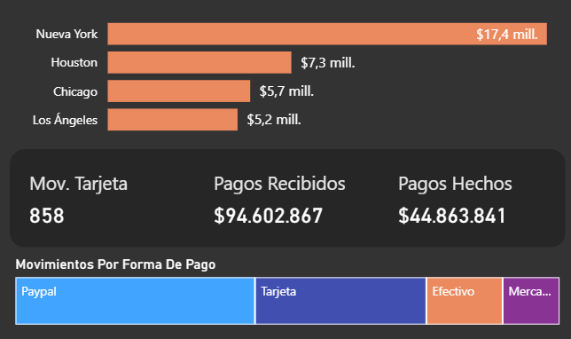

# Dashboard de Análisis Bancario

Este dashboard presenta un **análisis general de movimientos bancarios** en dólares (USD), permitiendo visualizar pagos recibidos, pagos hechos, impuestos, utilidad, evolución mensual de la utilidad y distribución de pagos por banco y forma de pago.

---

### 📊 KPIs Principales

El dashboard incluye los siguientes indicadores clave:

- **Pagos Recibidos:** $94.602.867
- **Pagos Hechos:** $44.863.841
- **Impuestos:** $14,19 millones
- **Utilidad:** $36 millones
- **Margen:** 37,58%
- **Total de Movimientos:** 2.725 (858 hechos con tarjeta, representando el 31,49% de las transacciones)

---

### 🔍 Filtros Disponibles

- **Banco:** Bank of America, BBVA Bancomer, Chase Bank, Citigroup, Santander (seleccionables desde el panel lateral)

---

### 📈 Visualizaciones Principales

#### 1. Utilidad por Mes — Gráfico de Cascada (Waterfall)

Gráfico de cascada que muestra la evolución mensual de la utilidad a lo largo del año, segmentado en tres categorías:

- 🟩 **Aumento:** meses con incremento respecto al anterior
- 🟥 **Disminución:** meses con caída
- 🟦 **Total:** barra final acumulada ($36 mill.)

> 💡 **Tooltip interactivo:** Al hacer hover sobre cada barra del gráfico de cascada, se despliega un tooltip personalizado con información detallada por ciudad y forma de pago:
>
> 
>
> El tooltip muestra:
> - **Pagos recibidos por ciudad:** Nueva York ($17,4 mill.), Houston ($7,3 mill.), Chicago ($5,7 mill.), Los Ángeles ($5,2 mill.)
> - **KPIs resumidos:** Mov. Tarjeta (858), Pagos Recibidos ($94.602.867), Pagos Hechos ($44.863.841)
> - **Movimientos por Forma de Pago:** Paypal, Tarjeta, Efectivo, Mercado Pago

#### 2. Pagos Recibidos por Banco

Gráfico de barras horizontales que compara el total de pagos recibidos por cada entidad bancaria:

| Banco           | Pagos Recibidos |
|-----------------|----------------|
| Chase Bank      | $33 mill.      |
| Bank of America | $24 mill.      |
| BBVA Bancomer   | $17 mill.      |
| Santander       | $12 mill.      |
| Citigroup       | $7 mill.       |

#### 3. Indicadores de Movimientos

Tarjeta de texto que resume el comportamiento general de las transacciones:

- Total de movimientos: **2.725**
- Movimientos con tarjeta: **858** (31,49% del total)
- Margen general: **37,58%**

---

### 🛠️ Herramienta

Este dashboard fue desarrollado con **Microsoft Power BI Desktop** (archivo `.pbix`).