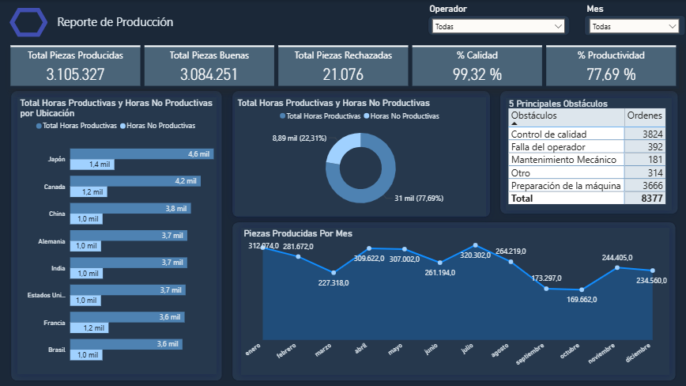

# Proyectos Power BI

Conjunto de dashboards realizados con fines de afianzar y demostrar habilidades clave en **Power BI**.

Este repositorio contiene **4 dashboards** independientes, cada uno enfocado en practicar diferentes aspectos de Power BI (ventas, finanzas,productividad,).  

<table>
  <tr>
    <td align="center" width="25%">
       
      <b>Ventas Tech</b>
    </td>
    <td align="center" width="25%">
       
      <b>Productividad</b>
    </td>
    <td align="center" width="25%">
       
      <b>Resumen Financiero</b>
    </td>
    <td align="center" width="25%">
       
      <b>Análisis Bancario</b>
    </td>
  </tr>
</table>

## ✨ Habilidades desarrolladas

- **Power BI** 
- **Power Query** 
- **DAX** 
- **Modelado de datos** 
- **Limpieza y preparación de datos** 

## 📸 Dashboards incluidos

Cada dashboard tiene su propia carpeta dedicada con todo lo necesario para entender y reproducirlo:

- **Datos originales** → Archivos fuente (CSV, Excel, etc.) usados para la carga.
- **Archivo Power BI (.pbix)** → El reporte completo.
- **README.md específico** → Documentacion detallada del proceso realizado en cada uno.
