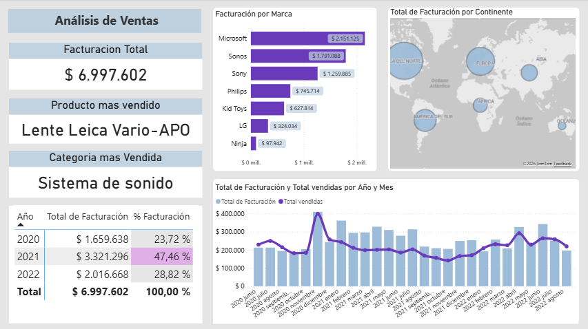

# Dashboard de Análisis de Ventas Tech

Este dashboard presenta un **análisis general de la facturación de ventas**, permitiendo visualizar ingresos, productos, marcas, categorías, evolución temporal y distribución geográfica de las ventas.

---

### 📊 KPIs Principales

El dashboard incluye los siguientes indicadores clave:

- **Facturación Total:** $6.997.602
- **Producto más vendido:** Lente Leica Vario-APO
- **Categoría más vendida:** Sistema de sonido

---

### 📈 Visualizaciones Principales

#### 1. Facturación por Marca

Gráfico de barras horizontales que muestra el total facturado por cada marca, destacando las de mayor aporte al ingreso total:

| Marca     | Total Facturado |
|-----------|----------------|
| Microsoft | $2.151.125     |
| Sonos     | $1.791.088     |
| Sony      | $1.259.885     |
| Philips   | $745.714       |
| Kid Toys  | $627.814       |
| LG        | $324.034       |
| Ninja     | $97.942        |

#### 2. Total de Facturación por Continente

Mapa geográfico que permite analizar la **distribución de las ventas a nivel global**, identificando los continentes con mayor volumen de facturación mediante burbujas proporcionales al monto vendido.

#### 3. Evolución de Facturación y Ventas por Año y Mes

Gráfico combinado que muestra la evolución temporal de las ventas entre 2020 y 2022:

- **Barras:** total de facturación por período
- **Línea:** total de unidades vendidas

La visualización está segmentada por **año y mes**, permitiendo detectar tendencias, estacionalidades y picos de facturación a lo largo del tiempo.

#### 4. Tabla de Facturación por Año

Tabla resumen con el total facturado y el porcentaje de contribución de cada año al total:

| Año       | Total Facturación | % Facturación |
|-----------|------------------|--------------|
| 2020      | $1.659.638       | 23,72%       |
| 2021      | $3.321.296       | 47,46%       |
| 2022      | $2.016.668       | 28,82%       |
| **Total** | **$6.997.602**   | **100,00%**  |

---
